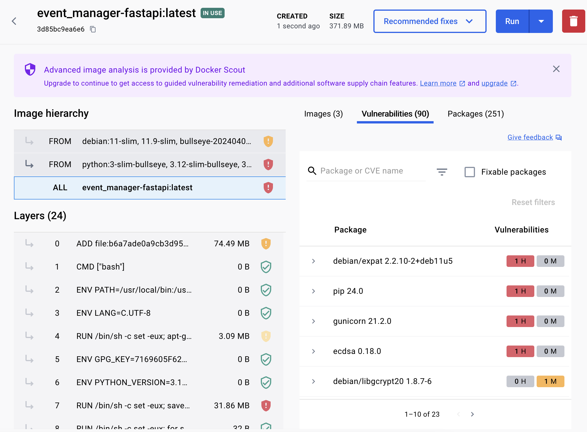

## 5 Issues

[#1](../../../../jennkanee/event_manager/issues/1)
[#2](../../../../jennkanee/event_manager/issues/3)
[#3](../../../../jennkanee/event_manager/issues/5)
[#4](../../../../jennkanee/event_manager/issues/6)
[#5](../../../../jennkanee/event_manager/issues/7)

## Docker Image

## Reflection

  This assignment was a great opportunity to refine both technical and collaborative skills. The assignment focused heavily on testing, making sure the project has a high percentage of test coverage. In addition, it was beneficial to examine the code and play around with the project, not only to write better tests, but also to better understand it. Working through this assignment gave me more confidence when it comes to understanding the need for testing, as well as writing the tests.

  This was my first introduction to using GitHub issues. What seemed intimidating before is no longer. Working through the issues on each branch then merging them into main was a very enjoyable process. Keeping issues separate was a great way to keep the project organized, which ultimately leads to more efficient, clear work. Moving forward, understanding and feeling comfortable with GitHub issues will continue to benefit myself and my projects.